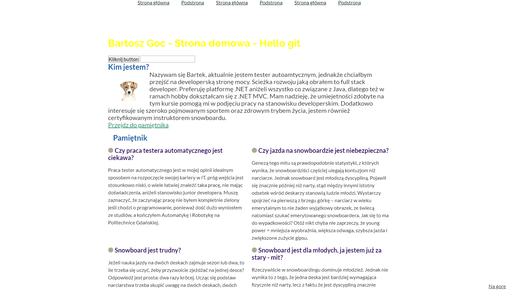

# Mój homepage

Zapraszam na moja strone: [Strona domowa Bartek Goc](https://bartoszgoc.github.io/homepage-hulp)

## Jak uruchomić stronę lokalnie

Aby uruchomic moją strone, wykonac poniższe polecenia:

`npm install -g gulp-cli`

`npm install`

`gulp`

To publish your page using github pages use `npm run deploy`
